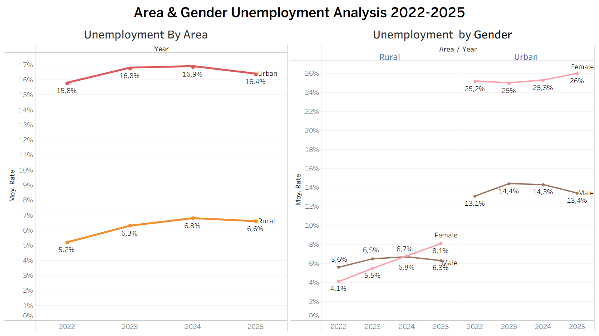
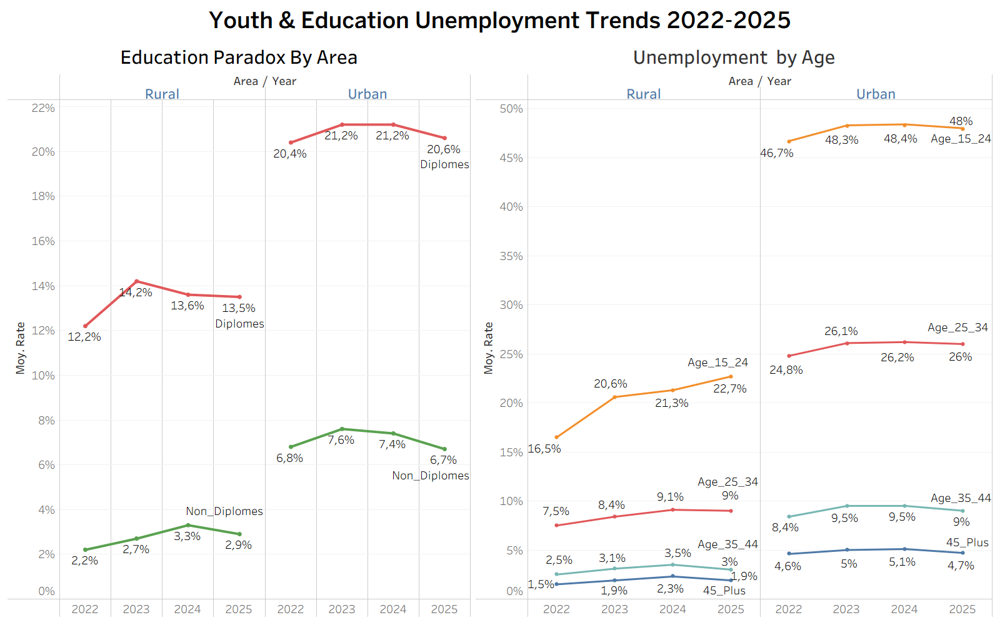

# Morocco Unemployment Dashboard (2022–2025) 🇲🇦📊

## Overview
This project presents a Tableau dashboard analyzing unemployment trends in Morocco between 2022 and 2025.

The analysis focuses on structural disparities in the Moroccan labor market by exploring unemployment patterns across:
- Age groups
- Gender
- Area of residence (Urban vs Rural)
- Education level (Diploma vs Non-Diploma holders)

The goal is to better understand which demographic groups are most affected by unemployment and identify labor market challenges that may require targeted policy responses.

---

## Key Questions Explored
- Which age groups experience the highest unemployment rates in Morocco?
- Are urban areas more affected by unemployment than rural areas?
- Is there a significant gender gap in unemployment?
- Does holding a diploma reduce unemployment risk?
- Which demographic groups should employment policies prioritize?

---

## Main Insights

### Urban vs Rural Disparities
- Urban unemployment remained consistently higher than rural unemployment from 2022 to 2025.
- This suggests stronger competition in urban labor markets and higher dependence on formal employment opportunities.

### Gender Gap in Employment
- Female unemployment rates remained significantly higher than male rates, particularly in urban areas.
- Urban women represent one of the most vulnerable groups in the labor market.

### Youth Unemployment Crisis
- Individuals aged **15–24** recorded the highest unemployment rates across all age groups.
- This highlights major school-to-work transition challenges for young Moroccans entering the labor market.

### Education Paradox
- Surprisingly, diploma holders experienced higher unemployment rates than non-diploma holders.
- This may indicate an education-employment mismatch between academic training and labor market demand.

### Priority Groups for Policy Action
Based on the analysis, employment policies should prioritize:
- Urban youth (15–24)
- Female job seekers in urban areas
- Educated job seekers facing labor market mismatch

---

## Dashboards

### 1. Area & Gender Analysis
This dashboard explores:
- Urban vs Rural unemployment trends
- Male vs Female unemployment disparities

---

### 2. Age & Education Analysis
This dashboard analyzes:
- Unemployment by age group
- Diploma vs Non-Diploma unemployment trends

---

## Tools Used
- Tableau
- Microsoft Excel

---

## Data Source
**Haut-Commissariat au Plan (HCP), Morocco**

Official open data on labor market indicators in Morocco.

