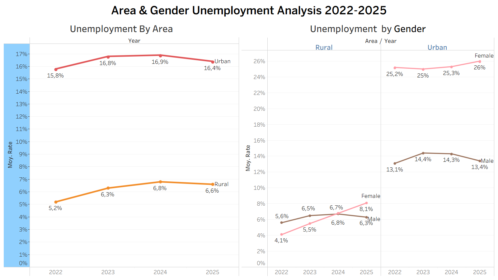

# Morocco Unemployment Dashboard (2022–2025)

## Project Overview
This project analyzes unemployment trends in Morocco between 2022 and 2025 using Tableau.

The dashboard explores:
- Age groups
- Gender disparities
- Urban vs Rural unemployment
- Education level and unemployment trends

## Key Insights
- Urban unemployment remained significantly higher than rural unemployment.
- Young people aged 15–24 recorded the highest unemployment rates.
- Diploma holders experienced higher unemployment rates than non-diploma holders.
- Female unemployment in urban areas remained significantly high.

## Tools Used
- Tableau
- Excel

## Data Source
Haut-Commissariat au Plan (HCP), Morocco

## Dashboard Preview

